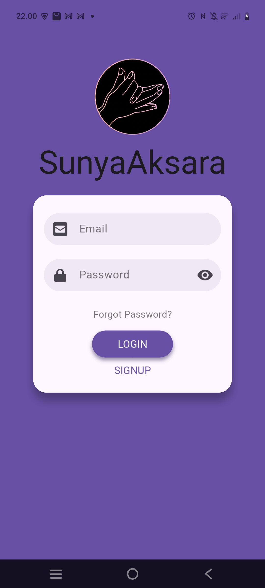
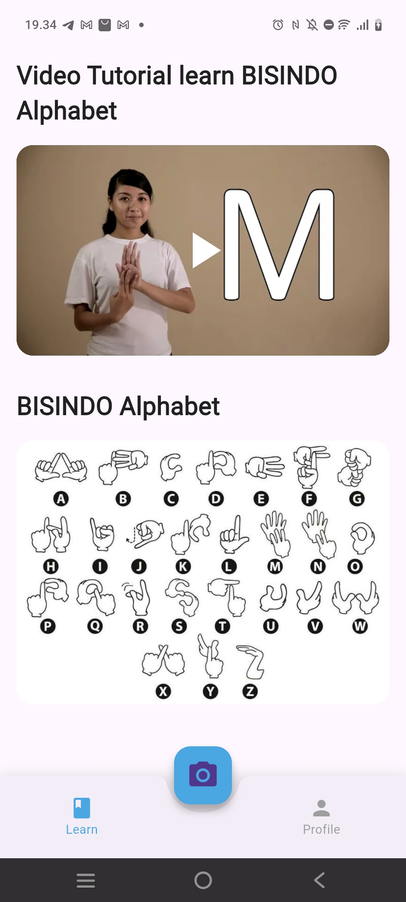
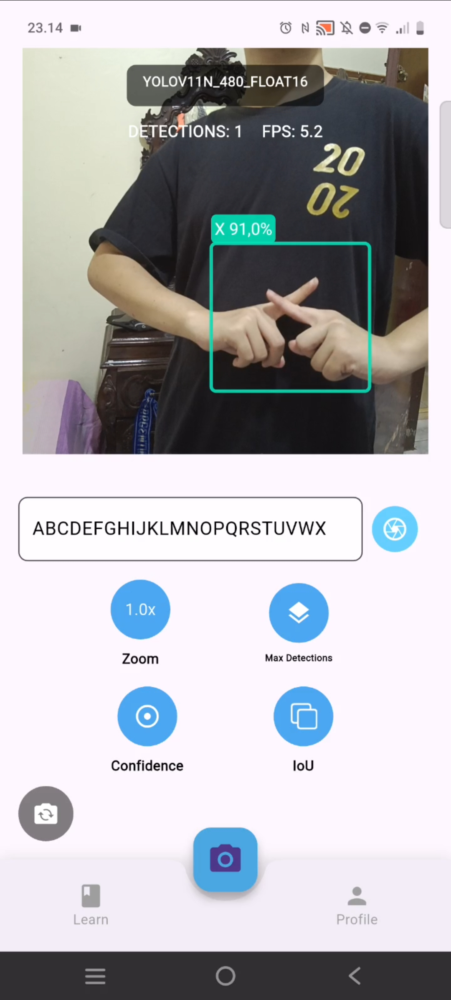
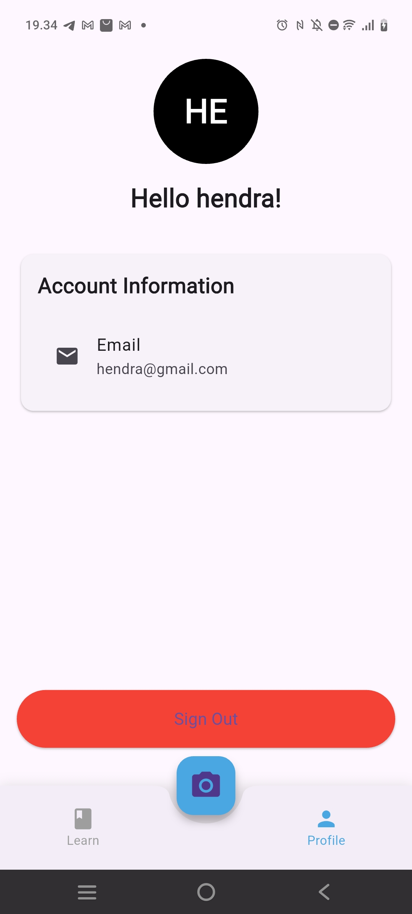

# YOLO Sign Language Detection App 🤟

A Flutter-based mobile application for real-time sign language detection using YOLO (You Only Look Once) object detection models. This project is developed as part of a Bachelor Thesis at Institut Teknologi Bandung (ITB) under course code **IF4092**.

> **⚠️ Android Only**: This application currently supports **Android devices only** due to native Android implementations of the YOLO inference engine.

## 📋 Overview

This application enables real-time detection and recognition of sign language gestures using computer vision and machine learning. The app features a user-friendly interface for learning BISINDO (Indonesian Sign Language) alphabet and provides interactive camera-based detection capabilities.

**Built upon**: Modified implementation of [Ultralytics YOLO Flutter App](https://github.com/ultralytics/yolo-flutter-app)

## 🎯 Application Features

### 🔐 Authentication System
<p align="center">
  
  <br>
  <em>Secure Firebase-based authentication system</em>
</p>

- Email/password authentication via Firebase
- User session management
- Secure login and registration flow

### 📚 Educational Module
<p align="center">
  
  <br>
  <em>Interactive BISINDO learning interface</em>
</p>

- **Video Tutorial**: YouTube integration for BISINDO alphabet learning
- **Visual Reference**: BISINDO alphabet poster and guides
- **Interactive Learning**: Step-by-step educational content

### 🎥 Real-time Detection
<p align="center">
  
  <br>
  <em>Real-time sign language detection in action</em>
</p>

- **Live Camera Inference**: Real-time YOLO-based detection
- **Dual Camera Support**: Optimized for both front and back cameras
- **Configurable Parameters**: Adjustable confidence, IoU thresholds
- **Performance Metrics**: Live FPS and detection statistics
- **Text Output**: Detection results with copy functionality

### 👤 User Profile
<p align="center">
  
  <br>
  <em>User profile and account management</em>
</p>

- User account information display
- Sign out functionality
- Account settings and preferences

## 🤖 YOLO Models

The application includes multiple pre-trained YOLO v11 models optimized for different use cases:

### Available Models
```
models/
├── yolov11n_352_float16.tflite    # Nano - 352px - FP16 (Fastest, smallest)
├── yolov11n_352_int8.tflite      # Nano - 352px - INT8 (Quantized)
├── yolov11n_480_float16.tflite   # Nano - 480px - FP16
├── yolov11n_480_int8.tflite      # Nano - 480px - INT8
├── yolov11s_352_float16.tflite   # Small - 352px - FP16 (Balanced)
├── yolov11s_352_int8.tflite      # Small - 352px - INT8
├── yolov11s_480_float16.tflite   # Small - 480px - FP16
├── yolov11s_480_int8.tflite      # Small - 480px - INT8
├── yolov11m_352_float16.tflite   # Medium - 352px - FP16 (Higher accuracy)
├── yolov11m_352_int8.tflite      # Medium - 352px - INT8
├── yolov11m_480_float16.tflite   # Medium - 480px - FP16
└── yolov11m_480_int8.tflite      # Medium - 480px - INT8
```

### Model Selection Guide

| Model Size | Resolution | Precision | Use Case | Performance | Accuracy |
|------------|------------|-----------|----------|-------------|----------|
| **Nano (n)** | 352px | FP16 | Low-end devices | ⭐⭐⭐⭐⭐ | ⭐⭐⭐ |
| **Nano (n)** | 352px | INT8 | Ultra-fast inference | ⭐⭐⭐⭐⭐ | ⭐⭐ |
| **Small (s)** | 352px | FP16 | Balanced performance | ⭐⭐⭐⭐ | ⭐⭐⭐⭐ |
| **Small (s)** | 480px | FP16 | Better accuracy | ⭐⭐⭐ | ⭐⭐⭐⭐⭐ |
| **Medium (m)** | 480px | FP16 | High-end devices | ⭐⭐⭐ | ⭐⭐⭐⭐⭐ |

**Recommended**: `yolov11s_352_float16.tflite` for most devices (good balance of speed and accuracy)

## 🏗️ Technical Architecture

### Technology Stack

- **Framework**: Flutter (Dart)
- **Backend**: Firebase (Authentication, Cloud Services)
- **ML Engine**: Modified Ultralytics YOLO v11 implementation
- **Inference**: TensorFlow Lite with optimized mobile deployment
- **Platform**: Android Native (Kotlin) with Flutter-Kotlin-C++ bindings
- **Camera**: CameraX API with optimized preview and frame processing
- **UI**: Material Design 3 with custom components

### Core ML Pipeline

The application leverages a sophisticated machine learning pipeline built upon TensorFlow Lite:

#### **TensorFlow Lite Integration**
- **Model Format**: YOLO v11 models converted to `.tflite` format for mobile optimization
- **Quantization**: Support for both FP16 and INT8 quantized models for performance/accuracy trade-offs
- **Hardware Acceleration**: Utilizes Android GPU delegate and NNAPI when available
- **Memory Management**: Efficient tensor allocation and buffer management

#### **Flutter-Kotlin-C++ Binding Architecture**
```
Flutter (Dart)
    ↓ Platform Channel
Kotlin (Android Native)
    ↓ JNI (Java Native Interface)  
C++ (TensorFlow Lite)
    ↓ Hardware Acceleration
GPU/NPU (Device Hardware)
```

#### **Optimized Inference Flow**
1. **Image Preprocessing**: Native Kotlin image processing with rotation and resizing
2. **Tensor Operations**: Direct memory mapping for efficient data transfer
3. **Model Inference**: TensorFlow Lite interpreter with multi-threading support
4. **Postprocessing**: Native Non-Maximum Suppression (NMS) implementation
5. **Rendering**: Hardware-accelerated overlay drawing with Canvas API

#### **Performance Optimizations**
- **Zero-Copy Operations**: Direct ByteBuffer manipulation to avoid memory copying
- **Asynchronous Processing**: Background thread inference to maintain UI responsiveness
- **Batch Processing**: Efficient handling of multiple detection outputs
- **Memory Pooling**: Reusable tensor buffers to minimize garbage collection

### Project Structure

```
lib/
├── main.dart                          # App entry point with Firebase setup
├── presentation/
│   ├── screens/
│   │   ├── login_screen.dart          # Authentication interface
│   │   ├── main_navigation_screen.dart # Bottom navigation controller
│   │   ├── camera_inference_screen.dart # Main detection interface
│   │   ├── learn_screen.dart          # Educational module
│   │   └── profile_screen.dart        # User profile management
│   └── widgets/                       # Reusable UI components
├── data/                              # Data models and repositories
└── core/                              # Core utilities and constants

packages/ultralytics_yolo/
├── android/src/main/kotlin/           # Native Android YOLO implementation
│   ├── YOLOView.kt                   # Camera preview with overlay
│   ├── ObjectDetector.kt             # YOLO inference engine
│   ├── PoseEstimator.kt             # Pose estimation capabilities
│   ├── Classifier.kt                 # Classification tasks
│   └── Segmenter.kt                  # Segmentation tasks
├── lib/                              # Flutter plugin interface
└── example/                          # Usage examples

assets/
├── models/                           # Pre-trained YOLO models
├── sign_logo.png                     # App logo
├── iou.png                          # IoU threshold icon
└── *.jpg                  # Thesis documentation images
```

## 🚀 Getting Started

### Prerequisites

- **Flutter SDK** (>=3.0.0)
- **Android Studio** with Android SDK (API level 21+)
- **Physical Android device** (recommended for testing camera features)
- **Firebase project** setup
- **Git** for version control

### Installation

1. **Clone the repository**
   ```bash
   git clone <repository-url>
   cd yolo-sign-language-app
   ```

2. **Install dependencies**
   ```bash
   flutter pub get
   ```

3. **Firebase Configuration**
   ```bash
   # Add your google-services.json to android/app/
   # Enable Authentication with Email/Password in Firebase Console
   ```

4. **Model Configuration** (Optional)
   ```dart
   // Default model: yolov11s_352_float16.tflite
   // To change model, edit in camera_inference_screen.dart
   final String modelPath = 'assets/models/yolov11s_352_float16.tflite';
   ```

5. **Build and Install**
   ```bash
   # Development build
   flutter run

   # Production release
   flutter build apk --release
   adb install build/app/outputs/flutter-apk/app-release.apk
   ```

## ⚙️ Configuration Options

### Detection Parameters
- **Confidence Threshold**: 0.1 - 0.9 (default: 0.25)
- **IoU Threshold**: 0.1 - 0.9 (default: 0.45)  
- **Maximum Detections**: 5 - 50 (default: 25)
- **Zoom Level**: 0.5x - 3.0x (back camera only)

### Camera Settings
- **Front/Back Camera**: Toggle between cameras
- **Real-time Processing**: 30+ FPS on most devices
- **Optimized Rotations**: 90° for front, 270° for back camera
- **Auto-focus**: Continuous autofocus for better detection

## 📊 Performance Metrics

### Device Compatibility
- **Minimum**: Android API 21+ (Android 5.0)
- **Recommended**: Android 8.0+ with 4GB+ RAM
- **Optimal**: Devices with dedicated NPU/GPU acceleration

### Benchmark Results
| Device Type | Model | FPS | Detection Latency |
|-------------|-------|-----|------------------|
| High-end | yolov11m_480_float16 | 25-30 | ~35ms |
| Mid-range | yolov11s_352_float16 | 20-25 | ~45ms |
| Budget | yolov11n_352_int8 | 15-20 | ~65ms |

## 📚 Research Context

### Bachelor Thesis Information
- **Institution**: Institut Teknologi Bandung (ITB)
- **Course Code**: IF4092 (Final Project/Thesis)
- **Focus Area**: Computer Vision and Machine Learning for Accessibility
- **Research Topic**: Real-time Sign Language Detection using Deep Learning

### Academic Contributions
- Modified YOLO architecture for sign language detection
- Performance optimization for mobile deployment
- Educational application development
- Comparative analysis of model variants

## 🤝 Contributing

This is an academic research project. Contributions are welcome in areas of:

- **Model Optimization**: Improving inference speed and accuracy
- **UI/UX Enhancement**: Better user experience design
- **Educational Content**: Additional learning materials
- **Platform Expansion**: iOS support (future work)

### Development Guidelines
1. Follow Flutter/Dart coding standards
2. Test on physical Android devices
3. Document any model changes
4. Maintain compatibility with existing Firebase setup

## 🙏 Acknowledgments

- **Ultralytics Team**: Original YOLO Flutter implementation
- **ITB Computer Science Faculty**: Academic supervision and guidance
- **Firebase/Google**: Authentication and cloud infrastructure
- **Flutter Community**: Framework and plugin ecosystem
- **Research Participants**: Testing and validation support

## 📄 License

This project extends the [Ultralytics YOLO Flutter App](https://github.com/ultralytics/yolo-flutter-app) implementation. Please refer to the original repository for licensing terms.


---

**🎓 ITB Final Project (IF4092) - Computer Vision for Sign Language Recognition**

**Note**: This application is specifically trained for BISINDO (Bahasa Isyarat Indonesia) gestures. Model retraining may be required for other sign language variants.
